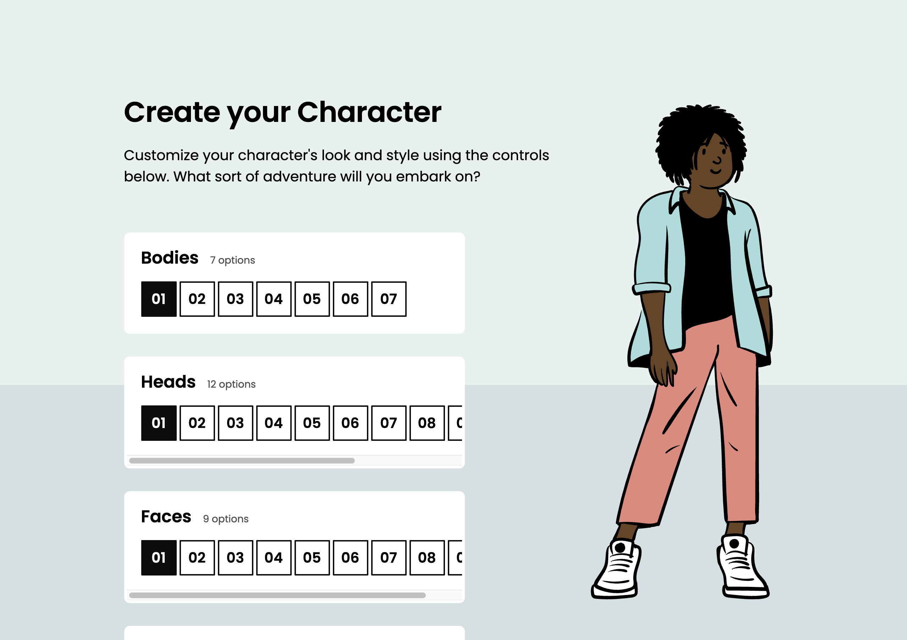
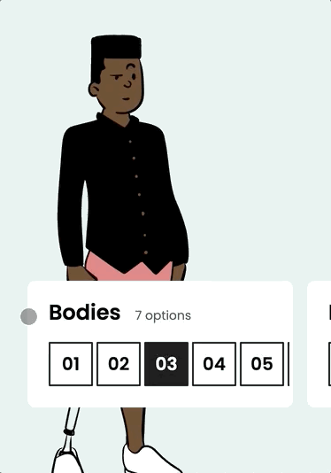
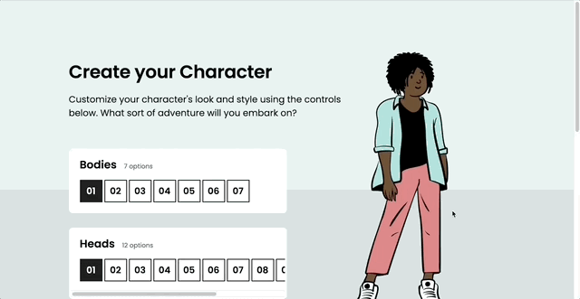
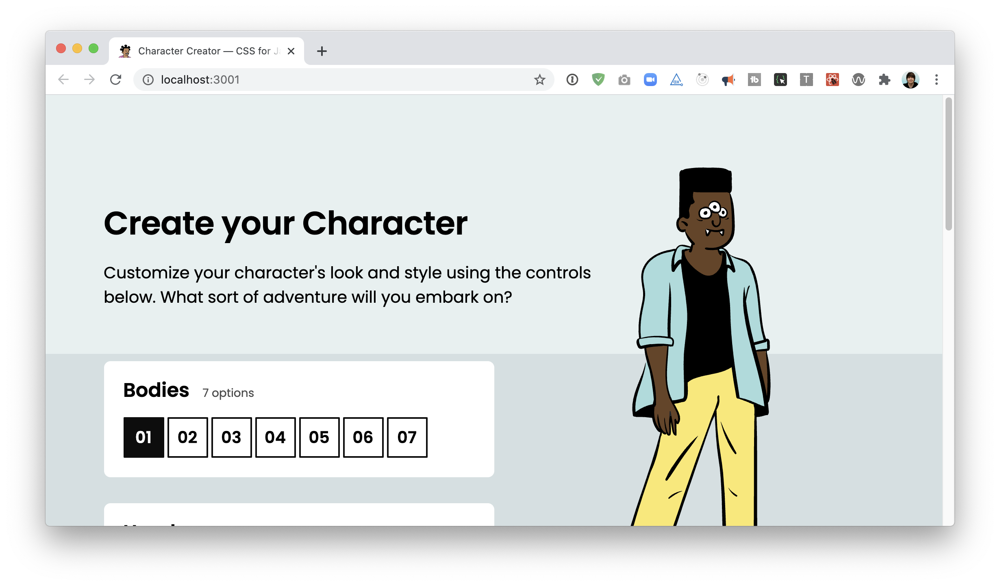
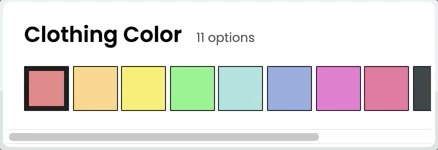
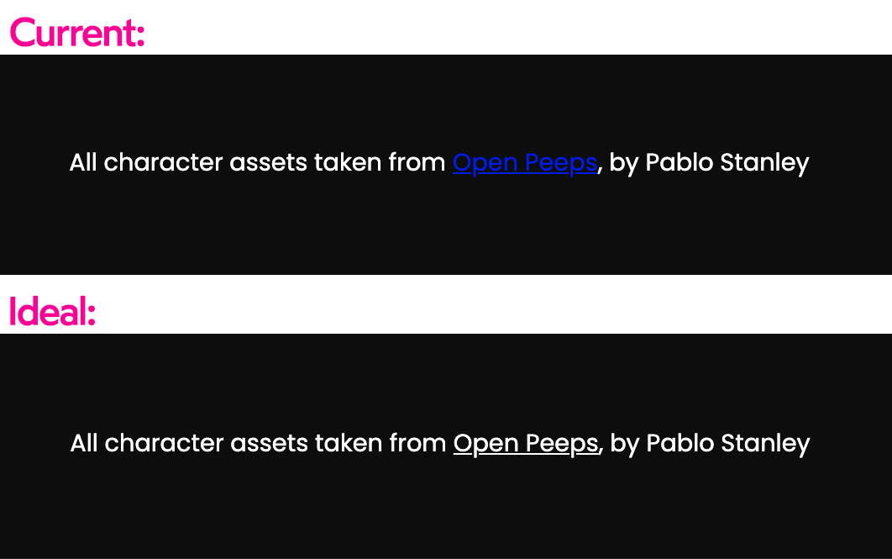
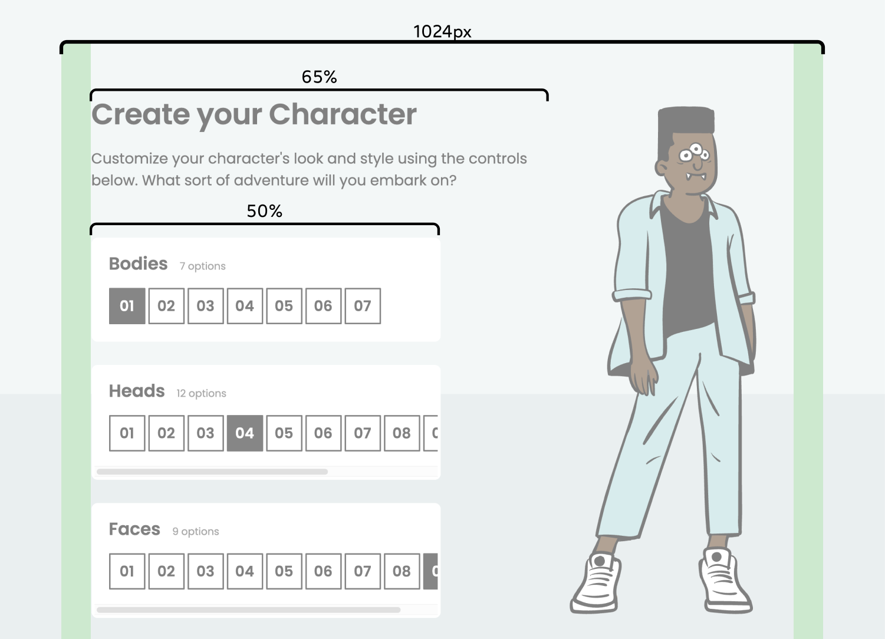

# Avatar Designer

🌟 **[Live Demo](https://custom-avatar-design.vercel.app/)** 🌟

An interactive React application for creating and customizing avatars. Users can design their perfect character by choosing from various body types, faces, accessories, and color combinations.



## ✨ Features

### Character Customization
- **7 Body Styles** - Choose from different character body types
- **12 Head Variations** - Select from various head shapes and styles  
- **9 Face Options** - Pick different facial expressions and features
- **6 Accessories** - Add glasses, hats, and other accessories
- **11 Skin Tones** - Wide range from Porcelain to Dark Espresso
- **11 Clothing Colors** - Vibrant color palette for outfits

### User Experience
- Real-time character preview with instant updates
- Intuitive control panels for each customization category
- Responsive design that works on desktop and mobile
- Smooth animations and transitions
- Clean, modern interface



## 🚀 Getting Started

### Prerequisites
- Node.js (version 12 or higher)
- npm or yarn package manager

### Installation

1. **Clone the repository**
   ```bash
   git clone https://github.com/your-username/Avatar-design.git
   cd Avatar-design
   ```

2. **Install dependencies**
   ```bash
   npm install
   ```

3. **Start the development server**
   ```bash
   npm run dev
   ```

4. **Open your browser**
   Navigate to `http://localhost:3000` to see the application

### Build for Production

```bash
npm run build
```

This creates an optimized production build in the `build` folder.

## 🎮 How to Use

1. **Select Body Type** - Choose your character's overall body style
2. **Pick a Head** - Select from 12 different head variations
3. **Choose Face** - Pick facial features and expressions
4. **Add Accessories** - Enhance your character with glasses, hats, etc.
5. **Customize Colors** - Select skin tone and clothing colors
6. **Admire Your Creation** - Watch your avatar update in real-time!



## 🛠 Technical Details

### Built With
- **React 18.2** - Frontend framework
- **CSS Modules** - Component-scoped styling
- **SVG Graphics** - Scalable vector graphics for characters
- **Vite** - Fast build tool and development server

### Project Structure
```
src/
├── components/
│   ├── Character/          # Main character rendering component
│   ├── CharacterEditor/    # Main editor interface
│   ├── ControlPane/        # Individual control panels
│   ├── ButtonRow/          # Option selection buttons
│   ├── ToggleButton/       # Individual toggle buttons
│   ├── Footer/             # App footer
│   └── MaxWidthWrapper/    # Layout component
├── constants.js            # Global configuration
├── utils.js               # Utility functions
└── index.css              # Global styles
```

### Customization Options

The application supports extensive customization through predefined options:

**Skin Colors**: 11 realistic skin tones from light to dark
- Porcelain, Ivory, Warm Ivory, Sand, Warm Beige
- Honey, Golden, Almond, Chestnut, Espresso, Dark Espresso

**Clothing Colors**: 11 vibrant colors for outfits
- Pale Tomato, Goldenrod, Sunshine, Grass, Teal
- Cobalt, Fuscia, Pink, Dark Gray, Gray, White

## 🖼 Screenshots & Features

### Responsive Design


### Smooth Scrolling


### Footer Design


### Size Variations


## 🧪 Available Scripts

- `npm run dev` - Runs the app in development mode with hot reload
- `npm run build` - Builds the app for production
- `npm run preview` - Preview the production build locally

## 🤝 Contributing

1. Fork the repository
2. Create your feature branch (`git checkout -b feature/AmazingFeature`)
3. Commit your changes (`git commit -m 'Add some AmazingFeature'`)
4. Push to the branch (`git push origin feature/AmazingFeature`)
5. Open a Pull Request

## 📱 Browser Support

This application works on all modern browsers including:
- Chrome (latest)
- Firefox (latest)  
- Safari (latest)
- Edge (latest)

## 🎨 Future Enhancements

- [ ] Save and load character presets
- [ ] Export character as PNG/SVG
- [ ] Social sharing functionality
- [ ] More clothing options and styles
- [ ] Background scene selection
- [ ] Animation poses and expressions

## 📄 License

This project is open source and available under the [MIT License](LICENSE).

## 🙏 Acknowledgments

- Character designs and artwork
- React community for excellent documentation
- Contributors and testers

---

**Ready to create your perfect avatar?** [Get started now!](#getting-started) 🎭